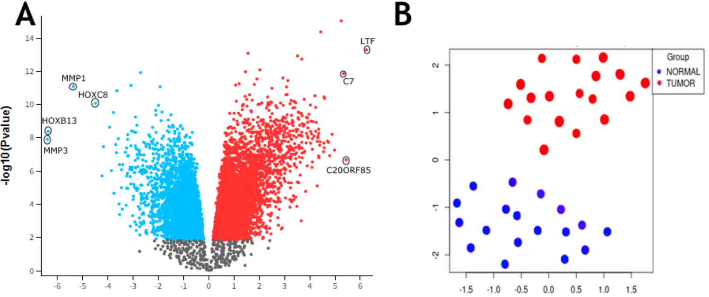
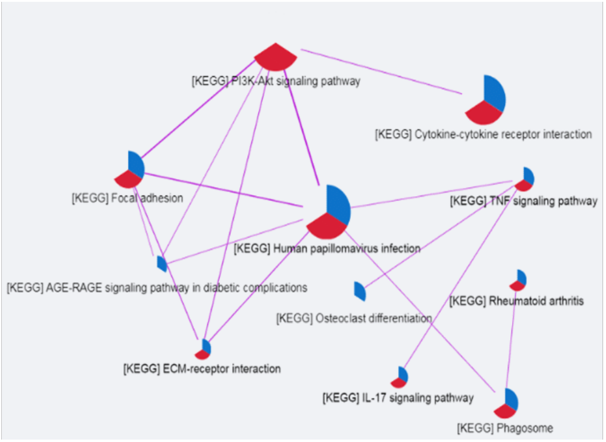
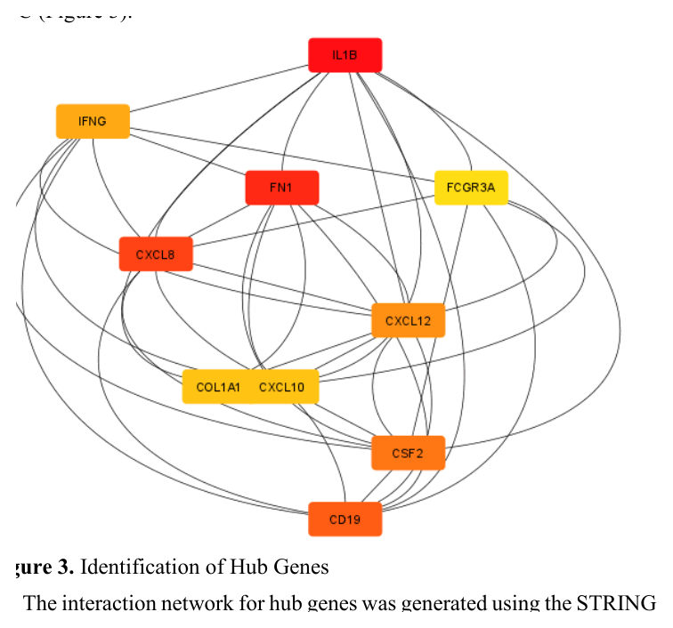
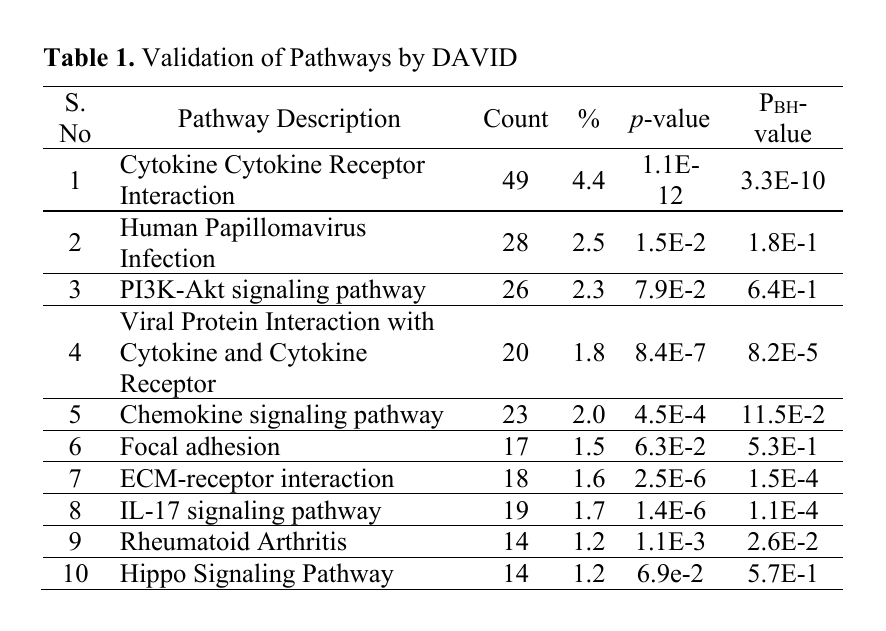
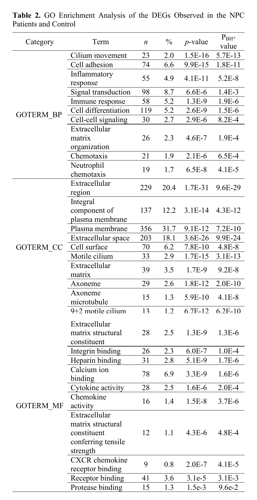
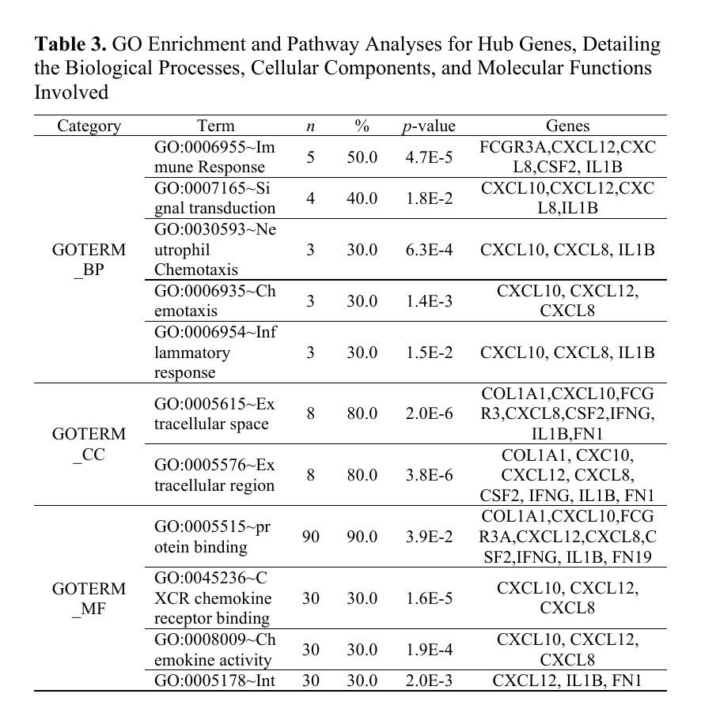
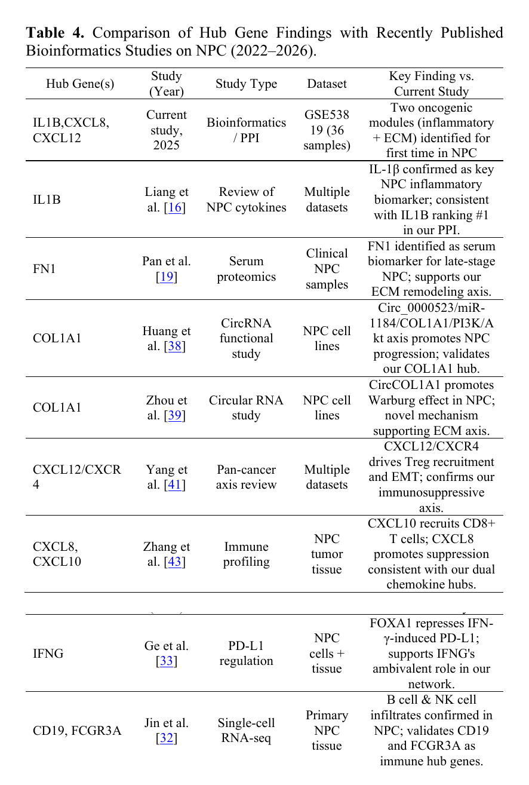

# Identification and Elucidation of Therapeutic Targets in Nasopharyngeal Carcinoma

### A Computational Bioinformatics Study

> Computational investigation of transcriptomic alterations in nasopharyngeal carcinoma using differential expression, pathway enrichment, protein-protein interaction networks, and hub-gene analysis.
>
> ## 📌 Project Overview

Nasopharyngeal carcinoma (NPC) is a malignant tumor with complex molecular characteristics. This study used publicly available gene-expression data to identify differentially expressed genes, enriched biological pathways, protein-protein interaction networks, and potential hub genes associated with NPC.

The analysis was performed using the **GEO dataset GSE53819**, containing **18 NPC tumor samples and 18 normal nasopharyngeal tissue samples**. The study integrated differential expression analysis, pathway enrichment, and PPI network analysis to prioritize candidate therapeutic targets.

## 📊 Dataset

**GEO accession:** [GSE53819](https://www.ncbi.nlm.nih.gov/geo/query/acc.cgi?acc=GSE53819)

The dataset contains **36 samples**:

- **18 primary nasopharyngeal carcinoma (NPC) tumor samples**
- **18 normal nasopharyngeal tissue samples**

**Platform:** Agilent-014850 Whole Human Genome Microarray 4x44K, **GPL6480**

The dataset was obtained from the publicly accessible **Gene Expression Omnibus (GEO)** database and was used for transcriptomic analysis of NPC. 

## 🔬 Analysis Methods

The computational workflow consisted of four main stages:

1. **Differential Expression Analysis**
   - GEO2R was used to identify differentially expressed genes.
   - Genes were filtered using adjusted *p* ≤ 0.05 and a final `|logFC| > 1.5` criterion.

2. **Functional & Pathway Enrichment**
   - Gene Ontology (GO) and KEGG pathway enrichment were performed.
   - Consensus Pathway Analysis (CPA) integrated Wilcoxon, FGSEA, and Kolmogorov-Smirnov tests.
   - DAVID was used for pathway validation.

3. **Protein-Protein Interaction Network**
   - STRING was used to construct the PPI network.
   - Interactions below a confidence score of 0.4 were excluded.
   - Cytoscape was used for network visualization.

4. **Hub Gene Identification**
   - CytoHubba was used within Cytoscape.
   - The Maximal Clique Centrality (MCC) method was used to prioritize hub genes.
  
   - ## 📈 Key Results

- **11,331** differentially expressed genes were initially identified.
- After filtering, **250 high-confidence DEGs** remained, including **213 upregulated** and **37 downregulated** genes.
- **11 KEGG pathways** showed significant enrichment.
- The PPI network contained **119 nodes and 5,040 edges**.
- **10 hub genes** were prioritized using the MCC method:

`IL1B · FN1 · CXCL8 · CD19 · CSF2 · CXCL12 · IFNG · COL1A1 · CXCL10 · FCGR3A`

### Key Biological Findings

Two major network modules were highlighted:

**Inflammatory cytokine–chemokine axis**  
`IL1B → CXCL8 → CXCL12`

**ECM remodeling axis**  
`FN1 → COL1A1`

Together, these findings suggest coordinated inflammatory and extracellular-matrix processes associated with NPC progression and tumor immune regulation.

## 🔬 Study Workflow

## 📊 Results Visualization

### Figure 1 | Differential Expression Analysis

The GSE53819 dataset was analyzed to identify differentially expressed genes between nasopharyngeal carcinoma and normal nasopharyngeal tissue.

*Figure 1. Volcano plot and UMAP visualization of the GSE53819 dataset.*

---

### Figure 2 | Pathway Enrichment

Consensus pathway analysis identified enriched biological pathways associated with the differentially expressed genes.

*Figure 2. KEGG pathway enrichment analysis of differentially expressed genes.*

---

### Figure 3 | Hub Gene Interaction Network

The protein-protein interaction network was constructed using STRING and visualized in Cytoscape. CytoHubba with the MCC method was used to prioritize the top hub genes.

*Figure 3. Protein-protein interaction network showing the top 10 hub genes.*

---

## 📋 Results Tables

### Table 1 | DAVID Pathway Validation

*Table 1. Validation of enriched pathways using DAVID.*

---

### Table 2 | GO Enrichment Analysis

*Table 2. Gene Ontology enrichment analysis of differentially expressed genes.*

---

### Table 3 | Hub Gene Enrichment

*Table 3. GO and pathway enrichment analysis of the identified hub genes.*

---

### Table 4 | Comparison With Recent NPC Studies

*Table 4. Comparison of hub-gene findings with recently published bioinformatics studies of NPC.*

### 🧾 Conclusion

This study identified 10 hub genes associated with NPC through integrated differential-expression, pathway, and PPI network analyses.

Two major molecular modules were highlighted:

Inflammatory cytokine–chemokine signaling

Extracellular matrix remodeling

Among the identified genes, IL1B, FN1, CXCL8, CXCL12, and COL1A1 showed the strongest supporting evidence in the study and represent candidates for further investigation in NPC biomarker and therapeutic research.

Further functional and clinical validation is required to establish their biological and therapeutic significance.

## 📄 Publication

**Wajeeha Urooj**, Misbah Jamil, Zaneb Rehman, Aamra Sohail, Sidra Majaz, Ashfaq Ahmad.

**Identification and Elucidation of Therapeutic Targets in Nasopharyngeal Carcinoma: A Computational Approach**

*Current Trends in OMICS*, 6(1), 40–63, 2026.

📖 [Read the published article](https://journals.umt.edu.pk/index.php/CTO/article/view/7696)
